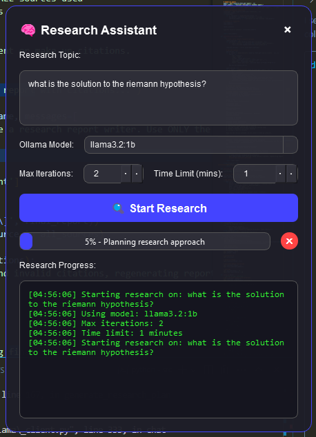

<p align="center">
  
</p>
<p align="center">
  <a href="https://ko-fi.com/theborch"></a>
  <a href="https://discord.gg/dAzSYcnpdF"></a>
</p>
# agentChef python package
## DeepResearch UI Installation Guide

(While im working on finishing agentChef feel free to test out this DeepResearch Module that will be a core component of it) DeepResearch is an AI-powered research assistant that helps automate the research process by searching the web, finding relevant papers, and generating comprehensive reports.

<p align="center">
  
</p>

## Prerequisites

- Python 3.8+ 
- pip (Python package manager)
- Ollama installed and running

## Installation Steps

### 1. Clone the Repository

```bash
git clone https://github.com/Leoleojames1/agentChef
cd agentChef
```

### 2. Create a Virtual Environment (Recommended)

```bash
# On Windows
python -m venv venv
venv\Scripts\activate

# or with conda
conda create -n agentChefEnv python=3.11

# On macOS/Linux
python -m venv venv
source venv/bin/activate

#or conda
conda activate agentChefEnv
```

### 3. Install Required Dependencies

```bash
pip install -r requirements.txt
```

If no requirements.txt file is available, install the required packages manually:

```bash
pip install PyQt6 PyQt6-WebEngine ollama markdown requests duckduckgo-search
```

### 4. Install Ollama

DeepResearch requires Ollama to access language models locally.

- Visit [Ollama's official website](https://ollama.ai/) to download and install
- After installation, pull a model:
  ```bash
  ollama pull llama3
  ```

### 5. Launch the Application

```bash
python DeepResearch.py
```

For advanced usage, you can specify research parameters via command line:

```bash
python DeepResearch.py --topic "Quantum computing algorithms" --model "llama3" --iterations 15 --time-limit 45
```

## Configuration

The default data directory is located at `~/.research_assistant`. Log files and research data will be stored here.

## Troubleshooting

- If you encounter issues with Ollama connection, ensure the Ollama service is running
- For PyQt6 installation problems, you may need to install additional system dependencies depending on your OS

## Dependencies

- PyQt6: For the graphical user interface
- Ollama: For local language model access
- Markdown: For report formatting
- DuckDuckGo-Search: For web searches
- Requests: For HTTP requests
- Concurrent.futures: For parallel processing

## License

[Apache 2.0 License Here]
